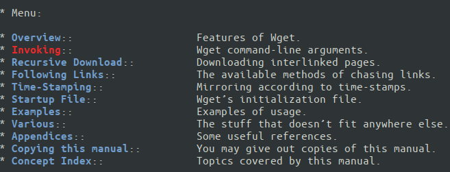
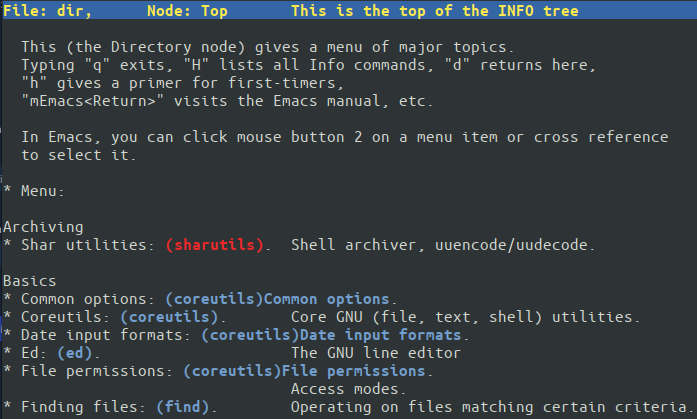

Module 03 - Help and Documentation


# Exercise 1: Using documentation resources 


## IMPORTANT commands and resources

```console
sosreport
pinfo
man
/usr/share/doc
```


### Step 1

Log in to the **CentOS7 VM** on the second virtual terminal ( `/dev/tty2` )  as `root`.


### Step 2

Generate a SOSReport using the `--batch` option.

```console
sosreport --batch
```


### Step 3

Use `pinfo` utility to to open the Texinfo documentation index and locate for the `wget` network downloader.


*NOTICE: the exact view of Texinfo pages may differ depending on various factors (installed packages, Linux distribution, etc.)*


If `wget` is not installed, run this command:

```console
yum -y install wget
```

Open `wget` Texinfo

```console
pinfo wget
```


### Step 4


Keep the `pinfo` utility open. Navigate to **Invoking** section.





Locate and and navigate to the **Recursive Retrieval Options** node.


Locate the option for creating a mirror of a site (Look for:  `-m`  or `--mirror`).


Use the `p` key to navigate through all the previous nodes, until you return to the **Invoking** section of `wget.info`.


Use the `u` key to navigate up to the top index of the Texinfo documentation.





### Step 5

Using the menu items in `coreutils.info` for reference, which commands might you use to:

* output only part of a file’s contents
* view user information
* change file attributes


#### Look for: `Output of parts of files::`
Utilities: `head`, `tail`, `split`, `csplit`


#### Look for: `User information::`
Utilities: `id`, `logname`, `whoami`, `groups`, `users`, `who`


#### Look for: `Changing file attributes::`
Utilities: `chgrp`, `chmod`, `chown`, `touch`


### Step 6

Quit the `pinfo` view by pressing the `q` key.


### Step 7

Find all the manual pages that match the keywords `bash`, `shell' and `grub`.

```console
man -k bash
man -k shell
apropos grub
```

### Step 8

Use the command `man man` and find the formatting conventions for the for the SYNOPSIS section of a page.


```console
man man
```

Once inside the man page, type `/SYNOPSIS` and hit `<ENTER>` to find occurence of word `SYNOPSIS` within the page. The search is case-insensitive. To go to the next occurence of matching string type `n`.


Remember the meaning of bold text (**command**), italics (*\<argument\>*), square braces (`[optional_arg]`), ellipses (`[arg]...`), and  pipes (`[-a|-A]`) when using the SYNOPSIS to learn how to effectively use commands.


### Step 9

Repeat and/or modify any parts of this lab you feel you need to practice or ask your instructor for additional practice exercises.  Notify the instructor when you have completed this lab and are ready to proceed.


