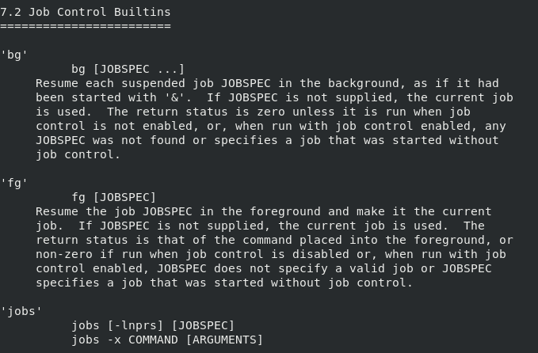
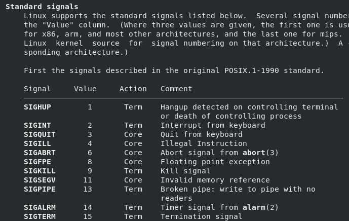

Module 08 - Managing Processes


# Exercise 1: Shell Job Control


## IMPORTANT COMMANDS


```console
sleep
jobs
bg
fg
vim
ip
```


## Instructions


### Step 1

Log in to the **CentOS7 VM** as `root`.


### Step 2

Run the command `pinfo bash` then navigate to the **Job Control::** node. Next open **Job Control Builtins::** and to look up how the built-in commands `jobs`, `bg`, and `fg` work. 





### Step 3

Run the command `sleep 10` and wait for the command prompt. The `sleep` command does what it sounds like - it just sleeps for X seconds then exits.


### Step 4

Run the command `sleep 1000` then use `<CTRL>+<z>` to suspend the process.


### Step 5

Run the command `jobs` to view the stopped job.


### Step 6

Run the command `bg %1` to resume the process in the background.


### Step 7

Run the command `sleep 5000 &`.


### Step 8

Run `jobs` again and notice the job numbers as well as the `+` and `-`.

* The `+` indicates the most recently used shell job.

In documentation the job number is often referred to as the ***jobspec***.


### Step 9

Open a new file with the command `vim ipinfo.txt`.


### Step 10

Suspend `vim` by pressing `<CTRL>+<z>`.

*NOTE*:  Make sure VIM is in *command mode* when pressing `<CTRL>+<z>`.


### Step 11

Run the command `ip addr show eth0` to find the first IP address used by the NIC.


*NOTE: the IP address doesn't matter - pausing and resuming the program are what matter for this exercise*


### Step 12

Run `jobs` to find the job number (*jobspec*) of the stopped `vim` editor.


### Step 13

Run `fg <jobspec>` to resume the stopped `vim`.


### Step 14

Enter the IP address and save the file.


### Step 15

Run `jobs` and terminate any jobs that are still running.


```console
kill %<jobspec>
```

You may choose to bring jobs to the foreground with `fg` and then interrupt them with `<CTRL>+<c>`.


### Step 16

Repeat and/or modify any parts of this lab you feel you need to practice or ask your instructor for additional practice exercises.  Notify the instructor when you have completed this lab and are ready to proceed.


# Exercise 2: Sending Signals and Interpreting Process Related Information


## IMPORTANT COMMANDS


```console
top
ps
nice
renice
kill
```


## Instructions


### Step 1

Log in to the **CentOS7 VM** on the first and second virtual terminals ( `/dev/tty1` and `/dev/tty2`) as `student`.


### Step 2

On the first terminal run this command.


```console
cat /dev/zero > /dev/null &
```


### Step 3

On the second terminal run `top` command to find the nice level (default 0) (`NI` column) of the `cat` command from the previous step.

*NOTE: `cat /dev/zero` process will use CPU intensively. `top` should display this process as one of the first ones in the process list.*


### Step 4

Switch back to the first terminal and use `ps aux` to find the PID of the `cat` command.


```console
ps aux | grep 'cat '
```

Alternative solution:

```console
pgrep -t tty1 cat
```


### Step 5

Use the `renice` command to increase by 10 the niceness of the running `cat` command.


***QUESTION***: Were you able to raise the niceness?  What is the new PRIORITY (`PR` column)?

You can see the changes using the instance of `top` running on the second terminal.


```console
renice --help
renice -n 10 <PID>
```

Alternative solution (if there's only single instance of `cat` running on `tty1`):

```console
renice -n 10 -p $(pgrep -t tty1 cat)
```


### Step 6

Use the `renice` command to decrease by 5 the niceness of the running `cat` command.


***QUESTION***: Were you able to lower the niceness?  Did the PRIORITY change?


You can see the changes using the instance of `top` running on the second terminal.


```console
renice -n 5 <PID>
```


### Step 7

Find the different signals you can send to processes.


```console
kill -l
```


More information on available signals.


```console
man 7 signal
```





### Step 8

Use the `kill` command to terminate the running `cat` command.


```console
kill <PID>
```

Alternative solutions:

```console
pkill -t tty1 cat
kill $(pgrep -t tty1 cat)
```


### Step 9


Start new `cat /dev/zero` process with nice value of 5. If nice value isn't specified, it defaults to 10.


```console
nice -n 5 cat /dev/zero > /dev/null &
```


### Step 10

Switch to the second terminal and use `top` to verify the nice level of the new running `cat` process.


### Step 11

Within `top` utility, use the `r` key to renice the process to a niceness of `19`.


### Step 12

Within `top` utility, use the `k` key to kill the `cat` process with the default signal of `SIGTERM`.


### Step 13

Repeat and/or modify any parts of this lab you feel you need to practice or ask your instructor for additional practice exercises.  Notify the instructor when you have completed this lab and are ready to proceed.


